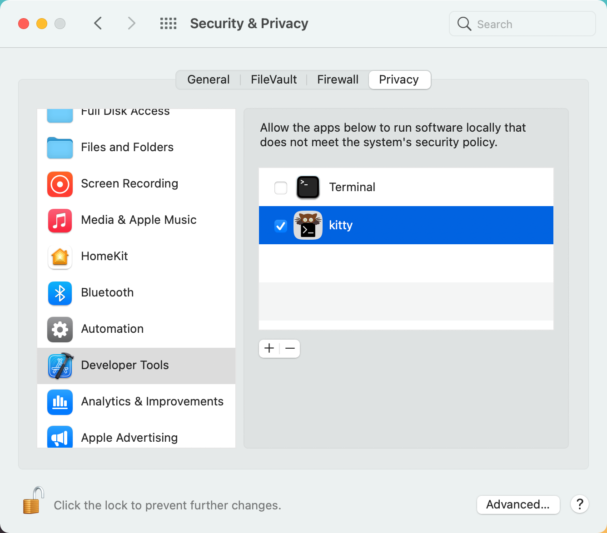

# felixge's dotfiles

These are my dotfiles. I don't recommend you to use them as-is, but rather to serve as an inspiration for your own configurations.

```
# initial installation
git clone https://github.com/felixge/dotfiles.git ~/dotfiles

# install dependencies
ansible-playbook ansible.yml

# install/update dotfiles after adding a new file
make

# add packer for vim, then run :PackerSync in vim
git clone --depth 1 https://github.com/wbthomason/packer.nvim ~/.local/share/nvim/site/pack/packer/start/packer.nvim

```

## Manual Config

I'll try to document important configurations changes that I have not automated yet below:

## Add kitty to Security & Privacy Developer Tools



This avoids [potential delays](https://sigpipe.macromates.com/2020/macos-catalina-slow-by-design/) due to macOS trying to do notarization.
