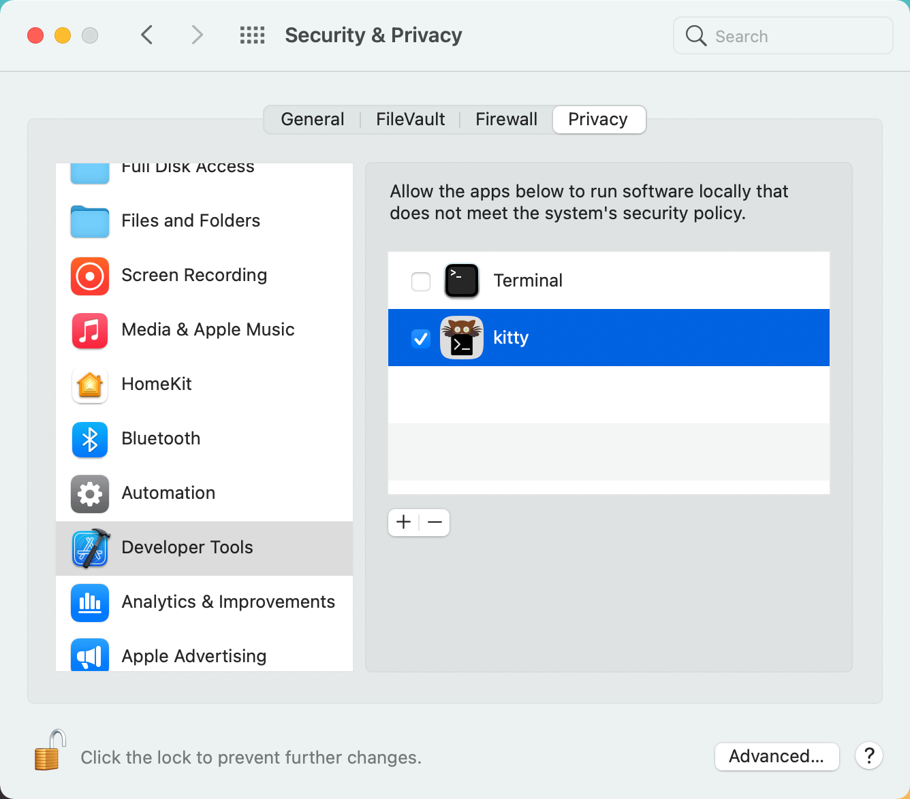

# felixge's dotfiles

These are my dotfiles. I don't recommend you to use them as-is, but rather to serve as an inspiration for your own configurations.

```bash
# initial installation
git clone https://github.com/felixge/dotfiles.git ~/dotfiles
"$HOME/dotfiles/install.bash"
```

To load individual installation functions without running the full bootstrap:

```bash
cd "$HOME/dotfiles"
source ./install.bash
```

## Testing

```
# test installation on ubuntu (docker)
make test-ubuntu

# interactive shell for debugging
make test-ubuntu-shell
```

## Manual Config

I'll try to document important configurations changes that I have not automated yet below:

## Add kitty to Security & Privacy Developer Tools



This avoids [potential delays](https://sigpipe.macromates.com/2020/macos-catalina-slow-by-design/) due to macOS trying to do notarization.